# OMSP 鸿蒙开源音乐协议播放软件 - AI 助手文档

> 文档生成时间：2026-02-04T07:45:43Z

## 变更记录 (Changelog)

| 日期 | 版本 | 变更内容 |
|------|------|----------|
| 2026-02-04 | 1.2.0 | 深度扫描更新，补充 module 级详细接口、依赖和核心功能分析 |
| 2026-02-04 | 1.1.0 | 深度扫描更新，补充模块级详细文档和架构图 |

---

## 项目愿景

OMSP (Open Music Source Protocol) 是一个基于鸿蒙系统的开源音乐协议播放软件。项目旨在提供统一的音乐数据源接口，支持多种音乐平台的接入，提供流畅的跨设备播放体验，并支持应用接续（Continuation）功能。

### 核心特性
- 支持多数据源管理（通过 OMSP 协议）
- 跨设备应用接续
- 响应式设计（手机、平板、2合1等）
- 本地数据源持久化存储（RelationalStore 分布式数据库）
- QR 码登录认证
- 歌单、艺术家、专辑等音乐内容浏览
- 分布式数据同步（跨设备）
- 动态主题色提取（基于封面图片）
- 播放列表管理（歌单、随机、队列）

---

## 模块结构图

```mermaid
graph TD
    A["(根) OMSPHarmony"] --> B["AppScope"];
    A --> C["entry"];

    B --> B1["app.json5 (全局配置)"];
    B --> B2["resources (全局资源)"];

    C --> C1["src/main/ets"];

    C1 --> CA["adapter (OMSP适配器-15个API)"];
    C1 --> CB["common (4个常量类)"];
    C1 --> CC["components (12个UI组件)"];
    C1 --> CD["data (数据源管理-分布式同步)"];
    C1 --> CE["model (数据模型-3个核心+13个协议模型)"];
    C1 --> CF["pages (2个页面+1个弹窗)"];
    C1 --> CG["utils (7个工具类)"];
    C1 --> CH["view (5个视图组件)"];
    C1 --> CI["viewmodel (4个ViewModel)"];
    C1 --> CJ["entryability (应用入口)"];
    C1 --> CK["entrybackupability (备份能力)"];

    CA --> CA1["omsp.ets (认证、歌单、歌曲、艺术家、搜索)"];

    CB --> CB1["AppConstants"];
    CB --> CB2["BreakpointConstants"];
    CB --> CB3["SourceDatabaseConstants"];
    CB --> CB4["EmitEventConstants"];

    CC --> CC1["CustomTitleBar (搜索/状态栏避让)"];
    CC --> CC2["MediaCard (图片/视频背景)"];
    CC --> CC3["ModuleCard"];
    CC --> CC4["ContentCard"];
    CC --> CC5["PlaylistListItem"];
    CC --> CC6["PlaylistSongGrid (响应式Grid)"];
    CC --> CC7["SongListItem"];
    CC --> CC8["ArtistListItem"];
    CC --> CC9["SettingItem"];
    CC --> CC10["SettingGroup"];
    CC --> CC11["PaddedContainer"];
    CC --> CC12["PlaylistInfoCard (动态主题色)"];

    CD --> CD1["SourceDataSource (CRUD+分布式同步)"];

    CE --> CE1["Source.ets"];
    CE --> CE2["ContinueData.ets"];
    CE --> CE3["WindowProperties.ets"];
    CE --> CE4["adapter (OMSP协议模型-13个)"];

    CE4 --> CE4A["Album"];
    CE4 --> CE4B["Artist"];
    CE4 --> CE4C["Playlist"];
    CE4 --> CE4D["Song"];
    CE4 --> CE4E["User"];
    CE4 --> CE4F["Lyric"];
    CE4 --> CE4G["Privilege"];
    CE4 --> CE4H["Types"];
    CE4 --> CE4I["StatusResponse"];
    CE4 --> CE4J["QrCreateResponse"];
    CE4 --> CE4K["QrCheckResponse"];
    CE4 --> CE4L["SongMeta"];

    CF --> CF1["Index.ets (主页面-Tab导航)"];
    CF --> CF2["PlaylistDetail.ets (歌单详情)"];
    CF --> CF3["dialog/ContentCardDetail (内容卡片详情)"];

    CG --> CG1["Logger (hilog日志)"];
    CG --> CG2["PreferencesUtil (首选项存储)"];
    CG --> CG3["Tools (cover/shuffle/sample)"];
    CG --> CG4["WindowUtil (窗口/断点/安全区)"];
    CG --> CG5["SouceRequest (Axios管理+拦截器)"];
    CG --> CG6["ImageColorExtractor (颜色提取/混合/渐变)"];
    CG --> CG7["Continue (应用接续)"];

    CH --> CH1["HomeView (首页-ForU/推荐/排行)"];
    CH --> CH2["LibraryView (库-歌单网格+搜索)"];
    CH --> CH3["MyView (我的-数据源+设置)"];
    CH --> CH4["SettingsView (设置-通用/播放/关于)"];
    CH --> CH5["SourceManagementView (数据源管理-增删改查/QR登录)"];

    CI --> CI1["CurrentSourceViewModel (当前数据源)"];
    CI --> CI2["SourceListViewModel (数据源列表)"];
    CI --> CI3["PlaylistViewModel (播放列表)"];
    CI --> CI4["SettingViewModel (系统设置)"];

    C --> C2["src/main/resources"];
    C --> C3["src/test (单元测试)"];
    C --> C4["src/ohosTest (鸿蒙测试)"];
```



---

## 模块索引

| 模块路径 | 职责描述 | 主要语言 | 入口文件 |
|----------|----------|----------|----------|
| [entry/](./entry/CLAUDE.md) | 主应用模块，包含 UI、数据管理、OMSP 适配器等 | ArkTS | `src/main/ets/entryability/EntryAbility.ets` |
| AppScope/ | 应用全局配置 | JSON5 | `app.json5` |

---

## 架构总览

### 技术栈
- **框架**：鸿蒙原生应用 (HarmonyOS Next)
- **语言**：ArkTS
- **UI 框架**：ArkUI (ComponentV2, ObservedV2)
- **网络**：@ohos/axios
- **数据存储**：
  - RelationalStore（分布式关系型数据库）
  - Preferences API（首选项存储）
- **路由**：HdsNavigation, NavPathStack
- **媒体**：@kit.ImageKit, @kit.AVSessionKit
- **分布式**：@kit.DistributedServiceKit

### MVVM 架构
```
View (视图层)
  ↓
ViewModel (视图模型层)
  ↓
Model (数据模型层)
  ↓
DataSource (数据持久化/网络请求)
```

### 数据流向
```
OMSP 服务器
  ↓
OMSPAdapter (adapter/omsp.ets) - 15个API接口
  ↓
ViewModel (viewmodel/*.ets) - 4个ViewModel
  ↓
View/Components (view/*.ets, components/*.ets) - 5个视图+12个组件
  ↓
SourceDataSource (本地存储 + 分布式同步)
```

### 目录结构说明

```
OMSPHarmony/
├── AppScope/                 # 应用全局配置
│   ├── app.json5             # 应用元信息
│   └── resources/            # 全局资源
├── entry/                    # 主应用模块
│   ├── src/main/ets/         # ArkTS 源码
│   │   ├── adapter/          # OMSP 协议适配器 (1个文件)
│   │   │   └── omsp.ets      # 认证、歌单、歌曲、艺术家、搜索等 15个 API
│   │   ├── common/           # 公共常量 (4个文件)
│   │   │   ├── AppConstants.ets
│   │   │   ├── BreakpointConstants.ets
│   │   │   ├── SourceDatabaseConstants.ets
│   │   │   └── EmitEventConstants.ets
│   │   ├── components/       # 可复用 UI 组件 (12个文件)
│   │   │   ├── CustomTitleBar.ets        # 标题栏
│   │   │   ├── MediaCard.ets              # 媒体卡片
│   │   │   ├── ModuleCard.ets             # 模块卡片
│   │   │   ├── ContentCard.ets            # 内容卡片
│   │   │   ├── PlaylistListItem.ets       # 歌单项
│   │   │   ├── PlaylistSongGrid.ets       # 歌曲网格
│   │   │   ├── SongListItem.ets           # 歌曲项
│   │   │   ├── ArtistListItem.ets         # 艺术家项
│   │   │   ├── SettingItem.ets            # 设置项
│   │   │   ├── SettingGroup.ets           # 设置组
│   │   │   ├── PaddedContainer.ets        # 安全容器
│   │   │   └── PlaylistInfoCard.ets       # 歌单信息卡片
│   │   ├── data/             # 数据源管理 (1个文件)
│   │   │   └── SourceDataSource.ets      # 分布式CRUD+同步
│   │   ├── model/            # 数据模型 (3+13个文件)
│   │   │   ├── Source.ets
│   │   │   ├── ContinueData.ets
│   │   │   ├── WindowProperties.ets
│   │   │   └── adapter/        # OMSP 协议数据模型 (13个)
│   │   ├── pages/            # 页面组件 (2+1个文件)
│   │   │   ├── Index.ets        # 主页面（Tab 导航）
│   │   │   ├── PlaylistDetail.ets
│   │   │   └── dialog/ContentCardDetail.ets
│   │   ├── utils/            # 工具类 (7个文件)
│   │   │   ├── Logger.ets
│   │   │   ├── PreferencesUtil.ets
│   │   │   ├── Tools.ets
│   │   │   ├── WindowUtil.ets
│   │   │   ├── SouceRequest.ets
│   │   │   ├── ImageColorExtractor.ets
│   │   │   └── Continue.ets
│   │   ├── view/             # 视图组件 (5个文件)
│   │   │   ├── HomeView.ets
│   │   │   ├── LibraryView.ets
│   │   │   ├── MyView.ets
│   │   │   ├── SettingsView.ets
│   │   │   └── SourceManagementView.ets
│   │   ├── viewmodel/        # 视图模型 (4个文件)
│   │   │   ├── CurrentSourceViewModel.ets
│   │   │   ├── SourceListViewModel.ets
│   │   │   ├── PlaylistViewModel.ets
│   │   │   └── SettingViewModel.ets
│   │   ├── entryability/     # 应用入口 (1个文件)
│   │   │   └── EntryAbility.ets
│   │   └── entrybackupability/ # 备份能力 (1个文件)
│   ├── src/main/resources/   # 资源文件
│   ├── src/test/             # 单元测试
│   └── src/ohosTest/         # 鸿蒙测试
└── oh_modules/               # 依赖模块（忽略）
```

---

## 核心模块详解

### view/ - 视图组件层

| 视图 | 功能描述 | 主要功能 |
|------|----------|----------|
| HomeView | 首页视图 | ForU模块、推荐歌单、推荐艺术家、排行榜、内容卡片跳转 |
| LibraryView | 库视图 | 用户歌单网格、搜索过滤、响应式布局(2/3/4列) |
| MyView | 我的视图 | 数据源管理入口、设置入口 |
| SettingsView | 设置视图 | 通用设置(主题/语言/缓存)、播放设置(音质/模式)、关于 |
| SourceManagementView | 数据源管理视图 | 增删改查、二维码登录、表单验证、主数据源设置 |

### components/ - UI 组件库

| 组件类型 | 组件 | 核心特性 |
|----------|------|----------|
| 导航组件 | CustomTitleBar | 状态栏避让、搜索框、返回按钮 |
| 媒体展示 | MediaCard | 图片/视频背景、操作插槽、宽高比支持 |
| 内容展示 | ContentCard/ModuleCard | 标题描述、内容插槽 |
| 列表组件 | PlaylistListItem/SongListItem/ArtistListItem | 封面、名称、元数据、操作插槽 |
| 布局组件 | PlaylistSongGrid | 响应式Grid(LG:2列/MD:1列/SM:List) |
| 设置组件 | SettingItem/SettingGroup | 开关/导航/文本三类型、分组管理 |
| 功能组件 | PaddedContainer/PlaylistInfoCard | 安全区避让、动态主题色提取 |

### utils/ - 工具类

| 工具类 | 核心功能 | 主要方法 |
|--------|----------|----------|
| Logger | 日志记录 | debug/info/warn/error (基于hilog) |
| PreferencesUtil | 首选项存储 | get/put/delete/clear (同步+异步) |
| Tools | 通用工具 | cover(封面URL)、shuffle(数组随机)、sample(随机取样) |
| WindowUtil | 窗口管理 | loadContent、断点监听、安全区处理 |
| SourceRequest | 网络请求 | Create/Get/Reload、请求拦截器、实例缓存 |
| ImageColorExtractor | 颜色提取 | extractMainColor、extractMultipleDominantColors、mixColors、adjustColorBrightness |
| Continue | 应用接续 | enableContinue、disableContinue、setContinueData |

### viewmodel/ - 视图模型层

| ViewModel | 核心状态 | 主要方法 |
|-----------|----------|----------|
| CurrentSourceViewModel | source, userPlaylists, newSongs, recommendPlaylists, recommendArtists, rankPlaylists | loadAll |
| SourceListViewModel | sources, isLoading, errorMessage, qrCodeVisible, qrCodeUrl, qrCodeStatus | loadSources, addSource, updateSource, deleteSource, generateQRCode, clearQRCodeTimer |
| PlaylistViewModel | currentIndex, playlist, mode | setMode, insertSongs, currentSong/nextSong/prevSong |
| SettingViewModel | theme, lang, playBitrate, downloadBitrate, dataSaverMode, maxCacheSize, mainSource | - (纯数据状态) |

### adapter/ - OMSP 协议适配器

**15个API接口**：

```
认证 (4个)：
├── GetQRKey         - 获取二维码唯一标识
├── CreateQR         - 创建二维码
├── CheckQR          - 检查二维码扫描状态
└── GetLoginStatus   - 获取登录状态

播放列表 (4个)：
├── GetUserPlaylists        - 获取用户歌单
├── GetRecommendPlaylists   - 获取推荐歌单
├── GetTopPlaylists         - 获取热门歌单
└── GetPlaylistDetail       - 获取歌单详情

歌曲 (3个)：
├── GetRecommendSongs - 获取推荐歌曲
├── GetSongDetail     - 获取歌曲详情
└── LikeSong          - 收藏歌曲

艺术家 (3个)：
├── GetRecommendArtists - 获取推荐艺术家
├── GetArtistDetail     - 获取艺术家详情
└── LikeAlbum           - 收藏专辑

专辑 (2个)：
├── GetAlbumDetail       - 获取专辑详情
└── GetSubscribedAlbums  - 获取已收藏专辑

搜索 (1个)：
└── Search            - 综合搜索
```

### model/ - 数据模型

**核心模型 (3个)**：
- Source - 数据源配置
- ContinueData - 应用接续数据
- WindowProperties - 窗口属性、断点、安全区

**协议模型 (13个)**：
- Song, Playlist, Artist, Album, User - 音乐核心实体
- Lyric - 歌词
- Privilege - 权限
- Types - 类型定义
- StatusResponse, QrCreateResponse, QrCheckResponse - API响应
- SongMeta - 歌曲元数据

---

## OMSP 协议工作流程

### 登录流程
```
1. GetQRKey 获取 unikey
2. CreateQR(unikey) 生成二维码
3. 用户扫码
4. CheckQR(unikey) 轮询检查状态
5. status=1 (等待确认) -> status=2 (成功)
6. GetLoginStatus 获取用户信息
7. 存储 token 到 Source
```

### 加载首页流程
```
1. 从 SettingViewModel 获取 mainSource
2. 从 SourceDataSource 加载对应 Source
3. SourceRequest.Create(Source.url, Source.token) 创建 Axios 实例
4. OMSPAdapter 调用各个 API 获取数据
5. CurrentSourceViewModel 更新状态
6. HomeView 渲染数据
```

---

## 运行与开发

### 环境要求
- DevEco Studio 5.0+
- HarmonyOS SDK API 12+
- ohpm 包管理器

### 构建命令
```bash
# 清理构建产物
hvigor clean

# 构建项目
hvigor build

# 运行单元测试
hvigor test
```

### 路由配置
路由配置位于 `entry/src/main/resources/base/profile/route_map.json`：

| 路由名称 | 页面文件 | 构建函数 |
|----------|----------|----------|
| ContentCardDetail | pages/dialog/ContentCardDetail.ets | ContentCardDetailBuilder |
| PlaylistDetail | pages/PlaylistDetail.ets | PlaylistDetailBuilder |

---

## 测试策略

### 测试文件位置
- `entry/src/test/` - 单元测试
- `entry/src/ohosTest/` - 鸿蒙 UI 测试

### 当前测试覆盖
- `List.test.ets` - 列表相关测试
- `LocalUnit.test.ets` - 本地单元测试
- `Ability.test.ets` - Ability 测试

---

## 编码规范

### 文件命名
- 组件文件：PascalCase（如 `MediaCard.ets`）
- 工具类文件：PascalCase（如 `Logger.ets`）
- 常量文件：PascalCase（如 `AppConstants.ets`）

### 代码组织
- 使用 `@ComponentV2` 装饰器定义组件
- 使用 `@ObservedV2` 定义响应式对象
- 使用 `@Local`、`@Provider`、`@Consumer` 进行状态管理
- 使用 `@Computed` 计算属性
- 使用 `@Monitor` 监听属性变化
- 使用 `@Trace` 标记可追踪字段

### 注释规范
- 使用 JSDoc 风格注释
- 公共 API 必须添加注释说明

---

## AI 使用指引

### 关键 API 路径
- **OMSP 协议适配器**：`entry/src/main/ets/adapter/omsp.ets` - 15个API接口
- **应用入口**：`entry/src/main/ets/entryability/EntryAbility.ets`
- **主页面**：`entry/src/main/ets/pages/Index.ets`
- **数据源管理**：`entry/src/main/ets/data/SourceDataSource.ets`

### 常见任务
1. **添加新的 OMSP API**：在 `adapter/omsp.ets` 中添加静态方法
2. **创建新页面**：在 `pages/` 或 `pages/dialog/` 目录创建文件并更新 `route_map.json`
3. **添加新组件**：在 `components/` 目录创建可复用组件
4. **管理数据源**：使用 `SourceDataSource` 和 `SourceListViewModel`
5. **响应式布局**：参考 `BreakpointConstants` 和 `WindowProperties`

### 数据流向
```
OMSP 服务器 --> OMSPAdapter (15个API) --> ViewModel (4个) --> View/Component (5+12个)
                          ↓
                   SourceDataSource (本地存储 + 分布式同步)
```

---

## 全局忽略规则

以下目录和文件被忽略（基于 .gitignore）：
- `node_modules/`
- `oh_modules/`
- `.idea/`
- `build/`
- `.hvigor/`
- `.cxx/`
- `.clangd/`
- `.clang-format/`
- `.clang-tidy/`
- `.test/`
- `.appanalyzer/`
- `arkts-docs/`
- `entry/build/` (构建产物)

---

## 相关链接
- [HarmonyOS 官方文档](https://developer.harmonyos.com/)
- [ArkTS 语言规范](https://developer.harmonyos.com/cn/docs/documentation/doc-guides/arkts-get-started)
- [entry 模块详细文档](./entry/CLAUDE.md)
